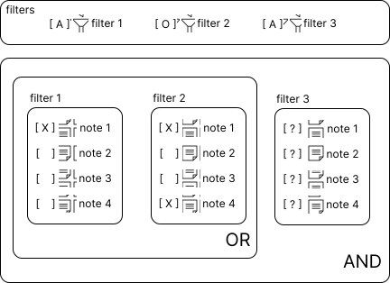
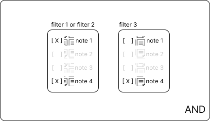
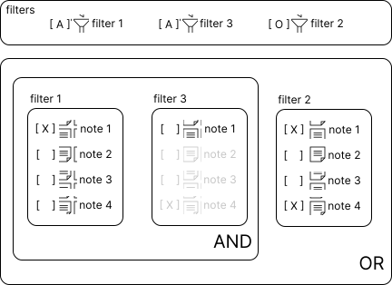
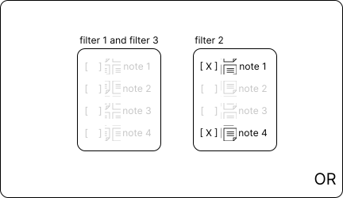
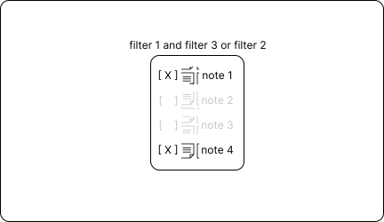

# Understanding filter `mode`
One important argument used in filters is `mode`. In this section, we'll explore how it works.

## And, or, and
Let's start example with a sequence of mode `and`, `or`, and `and`.
An example of how this sequence could be obtained is shown below.

```py
>>> from pyobsidian.vault import Vault
>>> vault = Vault('your/obsidian/vault/path')
>>> new_vault = (
...     vault
...     .find_by('folder', 'x', 'and')
...     .find_by('tag', 'y', 'or')
...     .find_by('related_note', 'z', 'and')
...     .execute()
... )
```

Let's consider that the analyzed vault has 4 notes. The image below illustrates this scenario.



- Filters with [A] represent filters that apply the "and" mode and [O] filters with "or" mode
- All notes with [ X ] represent notes that meet the filter criteria. Notes with [  ] do not meet the criteria
- Notes with [ ? ] are notes that the filter cannot yet evaluate because previous steps are necessary

In this situation, note 1 meets the criteria of filter 1 and notes 1 and 4 meet the criteria of filter 2.
Since filter 3 is applied after these filters, it does not yet know which notes will arrive to be evaluated. Therefore, it is not possible to know which notes meet the requirements of filter 3.

After applying filters 1 and 2, the scenario below is obtained.



Due to the conditions of filters 1 and 2, only notes 1 and 4 can be seen by filter 3. And only note 4 meets the criteria of filter 3. As the last condition is an "and", only notes that meet the final application will remain. In this case, only grade 4 meets all these requirements. This way, the final result is a grade 4.


## And, and, or
Now we will try to approach this problem with another sequence of filters: and, and, or.



In this situation, only note 1 meets the criteria of filter 1, so only this note can be seen by filter 3 since an "and" is applied with it. However, note 1 does not meet the criteria of filter 3. As a result, the final result of these steps does not return any note. However, it is important to highlight that filter 2, as it is applied as "or", can see all the notes in the vault in question.



With this scenario, because the mode is "or", all notes that meet the criteria will be filtered. In this case, only the notes filtered by filter 2 will remain.



## Behaviors
With these examples it is possible to note important characteristics when applying these modes:

- Filters applied with 'and' can only see the notes applied after the previous steps.
- Filters applied with 'or' can see all notes in the current vault.

This behavior of 'or' can be changed by executing `execute` before applying all steps. For example:
```py
>>> from pyobsidian.vault import Vault
>>> vault = Vault('your/obsidian/vault/path')
>>> new_vault = (
...     vault
...     .find_by('folder', 'x', 'and')
...     .execute()
...     .find_by('tag', 'y', 'or')
...     .find_by('related_note', 'z', 'and')
...     .execute()
... )
```

The execute performs the searches, so the 'or' method will only see the notes after the 'folder' filter. With this manipulation it is possible to create complex filters that meet different criteria.
